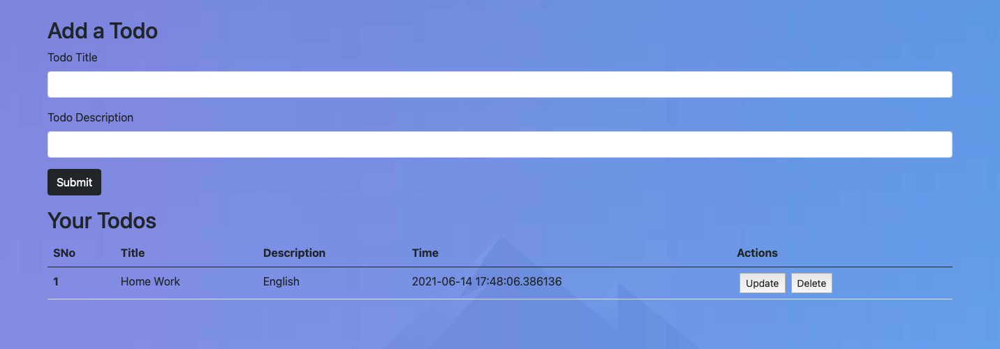
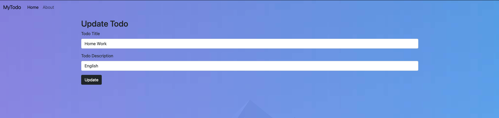

# TODO APP WITH FLASK


## Dependencies to install

Use pip to install the dependencies

```bash
  pip3 install flask
  
  pip3 install flask_sqlalchemy
  
  pip3 install datetime
```
  
## Running The Code

### To run the code, run the following command

Creating a Virtual Environment

```bash
  virtualenv -p python3 env  
```
To activate Virtual Environment

```bash
  source env/bin/activate  
```

For the output, run

```bash
  python3 app.py
```


  
## Screenshot Of The Output

### Home Screen


### TODO Screen



### Update Screen



  
## Author

- [@Mayank300](https://github.com/Mayank300)

  
